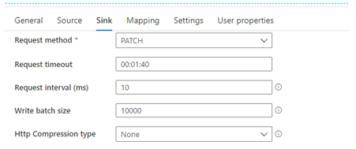
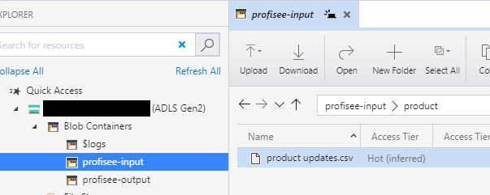
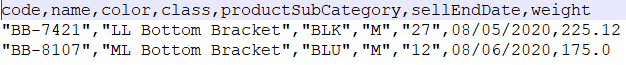

Copy from CSV Format to Profisee REST API
=========================================

This article describes a solution template that you can use to copy
records from Azure Data Lake Storage Gen2 CSV storage to Profisee REST
API.

About this solution template
----------------------------

This template copies records from ADLS Gen2 in CSV format to Profisee
via the REST API. The template is designed to work with a folder
structure consisting of a subfolder for each entity within the input
container. The file name must have the .csv extension.

**How to use this solution template**

1.  Go to the **Copy from CSV to Profisee REST API** template.

> 

1.  Create a **New** or use an existing connection to the
    BlobStorageGen2 data store that you are copying CSV data from.

2.  Create a **New** or use an existing connection to the Profisee REST
    API.

> 

1.  Follow these steps if you need to create a new REST linked service.

2.  Select “+ New" from the **REST** dropdown list.

> 

1.  Enter the following information for the REST linked service.

    1.  Name: Enter a unique name within your ADF.

    2.  Description: Enter an optional description.

    3.  Integration runtime: You can select the auto resolve option or
        create a custom integration runtime. Some linked services that
        ADF integrates with requires the ADF integration runtime be in
        the same region as the service. In this case you will need to
        create a custom integration runtime in the same region as that
        linked service.

    4.  Base URL: enter the base URL to your deployed Profisee REST API.

    5.  Authentication type: select **Anonymous**

> 

1.  Select **Use this template**.

2.  You will see a pipeline created as shown in the following example:

> 
>
> You should also see the following template validation output.
>
> 
>
> There is one item needed for the pipeline.

1.  **x-api-key:** The Profisee API key, which is the Client Id for the
    user account you are using to connect to the Profisee API. This is
    entered in the Source tab. **Note:** According to Microsoft, this
    will be an option in the Linked Service dialog when creating the
    REST API connection. We will update this documentation at that time.

> 

1.  The pipeline has the following Parameters and Variables

    1.  The FileFolder within the InputBlobCSV container.

    2.  The FileName of the file containing the records in CSV format
        which the Profisee REST Update API expects. Must end in .CSV
        file extension.

> 

1.  The EntityName.

> 

1.  The **Set EntityName variable** activity will set the **EntityName**
    variable using the FileFolder path. It uses a container name of
    **profisee-input** however you can use a different name. For
    example, a FileFolder path of **profisee-input/product** will result
    in an EntityName of **product**.

> 

1.  The Source dataset properties are set from the two pipeline
    parameters.

> 

1.  The Sink dataset properties are set from the EntityName variable and
    the isUpsert is set to true. You can change it to false if you wish
    to perform an Update instead of an Upsert. The **Request method**
    must be set to **PATCH**.

> 

1.  You can trigger the pipeline manually, but you can also create an
    Event trigger to trigger the pipeline to run any time a new file is
    uploaded to the container.

    1.  Set up your trigger pointing to your input container. Enter the
        **Container name** in this format **/&lt;container name&gt;/**.
        For example: **/profisee-input/**. Click **Continue** when done.
        Note: the Container name must match the input container name
        entered in the **Set EntityName variable** activity above.

> 

1.  Click **Continue** on the **Data preview** page.

> 

1.  Enter the following **Trigger Run Parameters**

> 

1.  Once you are finished with all your changes, click Publish All.

> 

1.  If you added an event trigger, upload a file to an entity folder
    within your input container. The file must contain the members in
    CSV format. An example is shown below.

> 
>
> 

1.  Select **Monitor** tab in the left navigation panel and wait for
    about 20 seconds. Click **Refresh** to get the updated run status.

2.  When the pipeline run completes successfully, you would see results
    like the following example. Notice the pipeline was triggered by the
    event trigger.

> 

Sink parameters
---------------

> You can customize the operation by changing **isUpsert** to false.
> When set to false it performs an Update instead of an Upsert (coming
> in a future release).
>
> 

Next steps
----------

-   [Introduction to Azure Data
    Factory](https://github.com/MicrosoftDocs/azure-docs/blob/master/articles/data-factory/introduction.md)
