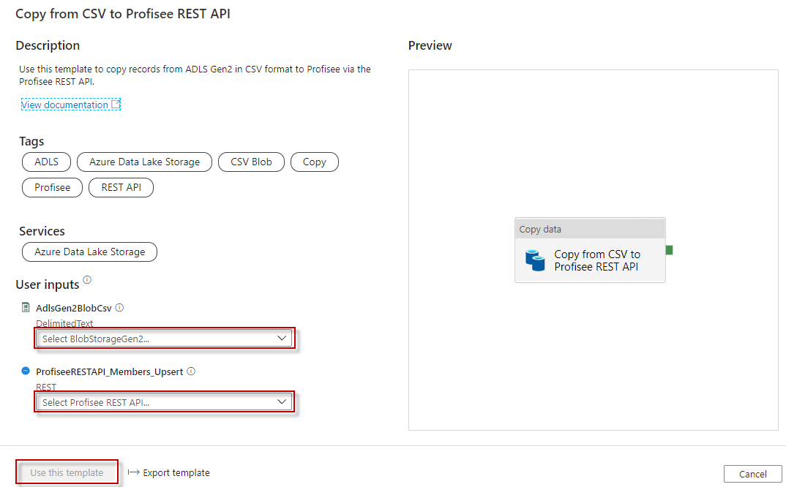
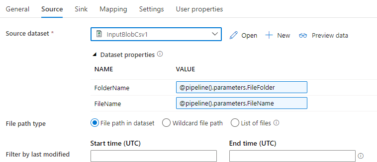
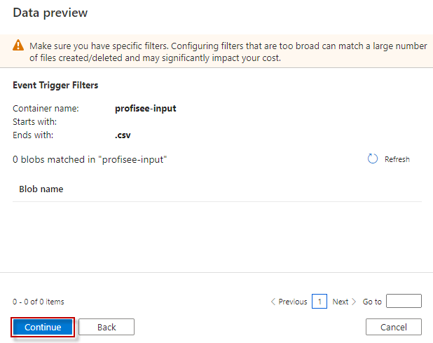

Copy from CSV Format to Profisee REST API
=========================================

This article describes a solution template that you can use to copy
records from Azure Data Lake Storage Gen2 storage, in CSV format, to
Profisee REST API.

About this solution template
----------------------------

This template copies records from ADLS Gen2 in CSV format to Profisee
via the REST API. The file name must have the .csv extension. The
template is designed to work with a folder structure consisting of
folders named for each entity within the input container. Create a
folder for each entity you wish to integrate with. CSV files containing
updates for an entity would get uploaded to the
profisee-input\\&lt;entity&gt; folder.

For example:

-   profisee-input
    -   account
    -   customer
    -   product

How to use this solution template
---------------------------------

1.  Go to the **Copy from CSV to Profisee REST API** template.

    

2.  Create a **New** or use an existing connection to the BlobStorageGen2 data store that you are copying CSV data from.

3.  Create a **New** or use an existing connection to the Profisee REST API.

    

    Follow these steps if you need to create a new REST linked service.

    1.  Select “+ New" from the **REST** dropdown list.

        

    2.  See [REST Linked Service](REST%20Linked%20Service.md) for information on setting up the REST linked service.

4.  Select **Use this template**.

5.  You will see a pipeline created as shown in the following example:

    
    
Pipeline
--------

### Parameters

1.  The FileFolder containing the file, includes the container name (e.g. profisee-input/product).

2.  The FileName of the file containing the records in CSV format which the Profisee REST Update API expects. Must end in .CSV file extension.

3.  If you plan on creating an Event trigger on the storage container, then you can leave the Default Values blank.

    

Copy Activity
-------------

### Source

1.  The Source dataset properties, FolderName and FileName, are set from the two pipeline parameters mentioned above.

    

### Sink

1.  The Sink dataset property, **entityId**, is set using the FileFolder
    path. It assumes a container name of **profisee-input** however
    you can use a different name. For example, a FileFolder path of
    **profisee-input/product** will result in an entityId of
    **product**. Note, the entityId can be either the entity’s Name,
    UID, or InternalId value.

    

2.  The **Request method** must be set to **PATCH**.

    

### Mapping

If you are copying all the fields in the file, no mapping is required.
You will only need to provide mappings if you wish to only copy a subset
of the fields in the file.

Trigger
-------

1.  You can trigger the pipeline manually, but you can also create an
    Event trigger to trigger the pipeline to run any time a new file is
    uploaded to the container. See this
    [link](https://docs.microsoft.com/en-us/azure/data-factory/how-to-create-event-trigger)
    for a full description about creating them.

    1.  Set up your trigger pointing to your input container. Enter the
        **Container name** in this format **/&lt;container name&gt;/**.
        For example: **/profisee-input/**. Click **Continue** when done.
        Note: the Container name must match the input container name
        entered in the **Set EntityName variable** activity above.

        

1.  Click **Continue** on the **Data preview** page.

    

1.  Enter the following **Trigger Run Parameters**.

    1.  The event trigger captures the folder path and file name of the
        blob into the properties **@triggerBody().folderPath** and
        **@triggerBody().fileName**. To use the values of these
        properties in a pipeline, you must map the properties to
        pipeline parameters.

        

Publish
-------

Once you are finished with all your changes, click Publish All.

Triggering
----------

1.  If you added an event trigger, upload a file to an entity folder within your input container. The file must contain the members in CSV format. An example is shown below.

    

    

2.  Select **Monitor** tab in the left navigation panel and wait for about 20 seconds. Click **Refresh** to get the updated run status.

3.  When the pipeline run completes successfully, you would see results like the following example. Notice the pipeline was triggered by the event trigger.

    

More Information
----------------

-   [Introduction to Azure Data
    Factory](https://github.com/MicrosoftDocs/azure-docs/blob/master/articles/data-factory/introduction.md)

-	[Copy data from and to a REST endpoint by using Azure Data Factory](https://docs.microsoft.com/en-us/azure/data-factory/connector-rest)

-   [Create event-based triggers in Azure Data
    Factory](https://docs.microsoft.com/en-us/azure/data-factory/how-to-create-event-trigger)
