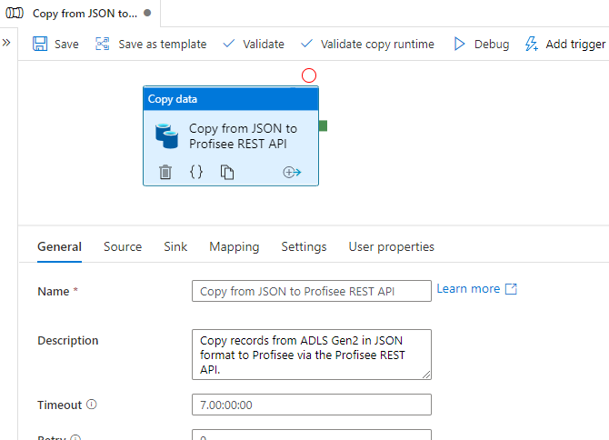
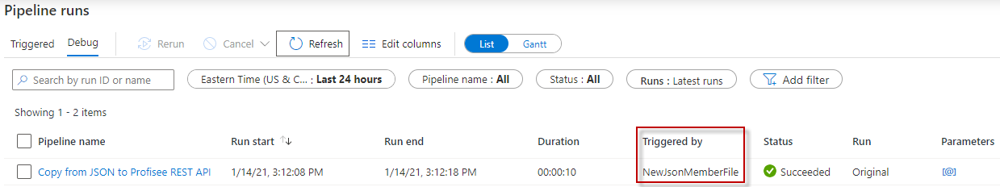

Copy from JSON Format to Profisee REST API
==========================================

This article describes a solution template that you can use to copy
records from Azure Data Lake Storage Gen2 storage, in JSON format, to
Profisee REST API.

About this solution template
----------------------------

This template copies records from ADLS Gen2 in JSON format to Profisee
via the REST API. The file name must have the .json extension. The
template is designed to work with a folder structure consisting of
folders named for each entity within the input container. Create a
folder for each entity you wish to integrate with. JSON files containing
updates for an entity would get uploaded to the
profisee-input\\&lt;entity&gt; folder.

For example:

-   profisee-input
    -   account
    -   customer
    -   product

How to use this solution template
---------------------------------

1.  Go to the **Copy from JSON to Profisee REST API** template.

    

1.  Create a **New** or use an existing connection to the
    BlobStorageGen2 data store that you are copying JSON data from.

2.  Create a **New** or use an existing connection to the Profisee REST
    API.

    

    Follow these steps if you need to create a new REST linked service.

    1.  Select “+ New" from the **REST** dropdown list.
    
        
    
    2.  Enter the following information for the REST linked service.
    
        1.  Name: Enter a unique name within your ADF.
    
        2.  Description: Enter an optional description.
    
        3.  Integration runtime: You can select the auto resolve option or
            create a custom integration runtime. Some linked services that
            ADF integrates with requires the ADF integration runtime be in
            the same region as the service. In this case you will need to
            create a custom integration runtime in the same region as that
            linked service.
    
        4.  Base URL: enter the base URL to your deployed Profisee REST API.
    
        5.  Authentication type: select **Anonymous**
    
            
    
4.  Select **Use this template**.

5.  You will see a pipeline created as shown in the following example:

    

    You should also see the following template validation output. We will correct that below.

    

Pipeline
--------

### Parameters

1.  The FileFolder containing the file, includes the container name (e.g. profisee-input/product).

2.  The FileName of the file containing the records in JSON format which the Profisee REST Update API expects. Must end in .JSON file extension.

3.  If you plan on creating an Event trigger on the storage container, then you can leave the Default Values blank.

    

Copy Activity
-------------

### Source

1.  The Source dataset properties, FolderName and FileName, are set from the two pipeline parameters mentioned above.

    

### Sink

1.  The Sink dataset property, **entityId**, is set using the FileFolder
    path. It assumes a container name of **profisee-input** however
    you can use a different name. For example, a FileFolder path of
    **profisee-input/product** will result in an entityId of
    **product**. Note, the entityId can be either the entity’s Name,
    UID, or InternalId value.

    

2.  The **Request method** must be set to **PATCH**.

3.  **x-api-key:** The Profisee API key, which is the Client Id for the
    user account you are using to connect to the Profisee API. The
    Client Id can be found in the FastApp Studio Accounts screen,
    within the Accounts and Teams admin area. This is entered in the
    Source tab.

    

### Mapping

If you are copying all the fields in the file, no mapping is required.
You will only need to provide mappings if you wish to only copy a subset
of the fields in the file.

Trigger
-------

1.  You can trigger the pipeline manually, but you can also create an
    Event trigger to trigger the pipeline to run any time a new file is
    uploaded to the container. See this
    [link](https://docs.microsoft.com/en-us/azure/data-factory/how-to-create-event-trigger)
    for a full description about creating them.

    1.  Set up your trigger pointing to your input container. Enter the
        **Container name** in this format **/&lt;container name&gt;/**.
        For example: **/profisee-input/**. Click **Continue** when done.
        Note: the Container name must match the input container name
        entered in the **Set EntityName variable** activity above.

        

1.  Click **Continue** on the **Data preview** page.

    

1.  Enter the following **Trigger Run Parameters**.

    1.  The event trigger captures the folder path and file name of the
        blob into the properties **@triggerBody().folderPath** and
        **@triggerBody().fileName**. To use the values of these
        properties in a pipeline, you must map the properties to
        pipeline parameters.

        

Publish
-------

Once you are finished with all your changes, click Publish All.

Triggering
----------

1.  If you added an event trigger, upload a file to an entity folder within your input container. The file must contain the members in JSON format. An example is shown below.

    

    

2.  Select **Monitor** tab in the left navigation panel and wait for about 20 seconds. Click **Refresh** to get the updated run status.

3.  When the pipeline run completes successfully, you would see results like the following example. Notice the pipeline was triggered by the event trigger.

    

Next steps
----------

-   [Introduction to Azure Data
    Factory](https://github.com/MicrosoftDocs/azure-docs/blob/master/articles/data-factory/introduction.md)

-   [Create event-based triggers in Azure Data
    Factory](https://docs.microsoft.com/en-us/azure/data-factory/how-to-create-event-trigger)
