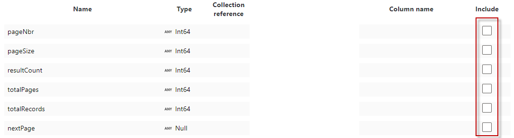

Copy from Profisee REST API to JSON Format
==========================================

This article describes a solution template that you can use to copy
records from Profisee REST API to Azure Data Lake Storage Gen2 JSON
storage.

About this solution template
----------------------------

This template retrieves records from Profisee REST API. It then copies
the records, in JSON format, to a file in the Sink container. When the
pipeline created by the template is run, it will create a folder for the
entity and copy the file to that folder. The file name is composed of
the entity name and date/time in UTC with the .json extension.

**How to use this solution template**

1.  Go to the **Copy from Profisee REST API to JSON** template.

> 

1.  Create a **New** or use an existing connection to the source
    Profisee REST API.

> 

1.  Follow these steps if you need to create a new REST linked service.

2.  Select “+ New" from the **REST** dropdown list.

> 

1.  Enter the following information for the REST linked service.

    1.  Name: Enter a unique name within your ADF.

    2.  Description: Enter an optional description.

    3.  Integration runtime: You can select the auto resolve option or
        create a custom integration runtime. Some linked services that
        ADF integrates with requires the ADF integration runtime be in
        the same region as the service. In this case you will need to
        create a custom integration runtime in the same region as that
        linked service.

    4.  Base URL: enter the base URL to your deployed Profisee REST API.

    5.  Authentication type: select **Anonymous**

> 

1.  Create a **New** or use an existing connection to the ADLS Gen2 sink
    data store that you are copying data to.

2.  Select **Use this template**.

3.  You will see a pipeline created as shown in the following example:

> 
>
> You should also see the following template validation output.
>
> 
>
> There are three items needed for the pipeline, one of them are
> mentioned above.

1.  **EntityName:** The entity you are copying records for. This is
    entered in the pipeline Variables tab.

> 

1.  **Container:** The output container where you are copying the file
    to. This is entered in the pipeline Variables tab. It defaults to
    “profisee-output”. You can update to another name based on your
    environment.

> 

1.  **x-api-key:** The Profisee API key, which is the Client Id for the
    user account you are using to connect to the Profisee API. This is
    entered in the Source tab.

> 

1.  Select **Mapping** tab to map the records result properties to the
    corresponding JSON column.

> First click the **Import Schemas** button. You will be prompted to
> confirm the value of the pipeline parameter for the EntityName. Click
> **OK**.
>
> 
>
> After a couple of seconds, you will see a list of mapping fields
> listed, as shown in the following example.
>
> 
>
> Next, select **data** from the **Collection reference** drop down
> list. The **data** property is the array of records.
>
> 
>
> Unselect the Include checkboxes for the pageNbr, pageSize,
> resultCount, totalPages, totalRecords, and nextPage properties as we
> do not want to copy them to the file.
>
> 
>
> After selecting the data collection reference, you need to correct the
> Column names for each property you want to copy. **Note:** Microsoft
> may change this to default to the correct Column name.
>
> From this
>
> 
>
> To this
>
> 

1.  Once you are finished with all your changes, click Publish All.

> 

1.  To run the pipeline now, select **Add Trigger** and select **Trigger
    now**. Press **OK** at the Pipeline run prompt.

2.  Select **Monitor** tab in the left navigation panel and wait for
    about 20 seconds. Click **Refresh** to get the updated run status.

3.  When the pipeline run completes successfully, you would see results
    like the following example:

> 

1.  You should also see the output file in the Container and Directory
    you entered.

> 

Source parameters
-----------------

> You can customize the records get API query with the following
> parameters.
>
> 

-   pageSize - The page size to get.  Defaults to 1000 if not supplied.

-   filter - A filter to restrict the members returned.

    -   \[&lt;attribute name&gt;\] &lt;operator&gt; &lt;value&gt;.

        -   Example: \[Color\] eq ‘BLU’.

    -   The filter can include multi-level attributes (MLAs).

        -   Example: \[ProductSubCategory\]/\[ProductCategory\] eq '1'.

    -   You can group attributes together using parenthesis and ANDs and
        ORs.

    -   You can also filter on Audit Info columns.  Use the following
        property names:

        -   created On (datetime) - datetime the record was created, in
            UTC

        -   created By (string) - user that created the record

        -   changed On (datetime)) - datetime the record was last
            changed, in UTC

        -   changed By (string) - user that last changed the record

-   attributes - A comma separated list of entity attribute names to
    return.  The list can include multi-level attributes (MLAs). If
    blank, all attributes are returned. Note: the attribute list
    determines the result properties you will see in the **Mapping**
    tab.

    -   MLAs are supported, using the ‘/’ to separate each part of the
        MLA path

    -   Example: \[Color\],\[Class\],\[ProductSubCategory\],\[SellStartDate\],\[SellEndDate\],\[Weight\],\[ProductSubCategory\]/\[ProductCategory\]/\[ProductGroup\]

-   orderBy - A comma separated list of entity attribute names and
    direction to order the response

    -   \[&lt;attribute name&gt;\] or \[&lt;attribute name&gt;\] asc -
        sorts attribute in ascending order

    -   \[&lt;attribute name&gt;\] desc - sorts attribute in descending
        order

    -   Example: \[ProductSubCategory\], \[SellStartDate\] desc

-   dbaFormat - The domain-based attribute (DBA) format to return.
    Provides an option to indicate how to return the DBA's Code and
    Name.  Note: a DBA is an attribute that points to, or references,
    another entity, called a domain entity. 

    -   Code only (default) - Only return the code value.

        -   Example: 

            -   "Source System": "SF",

    -   Code and Name simple properties.  The name property is returned
        as DBA.Name.

        -   Example: 

            -   "Source System": "SF",

            -   "Source System.Name": "Salesforce",

-   codes – A comma separated list of member codes to return. 

Sink parameters
---------------

> You can customize the directory and file name by changing the template
> values for the following parameters.
>
> 

Next steps
----------

-   [Introduction to Azure Data
    Factory](https://github.com/MicrosoftDocs/azure-docs/blob/master/articles/data-factory/introduction.md)
