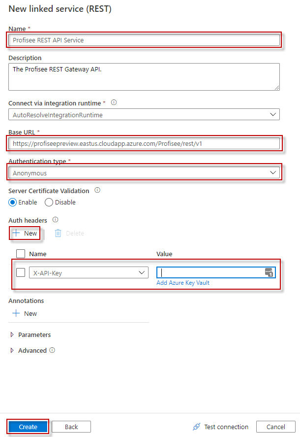

Configuring the REST Linked Service
=========================================

The REST linked service copies data to and from a REST endpoint, specifically the Profisee REST Gateway API.

Prerequisites
-------------
* The Profisee REST Gateway API key (X-API-Key) is the Client Id for the Profisee user account you are using to connect to the Profisee REST Gateway API. 
  * The Client Id can be found in the FastApp Studio Accounts screen, within the Accounts and Teams admin area.
* The Profisee user account has the necessary permissions needed to access and/or update records within Profisee.

Get Started
-----------
For detailed information on REST linked service, see [Copy data from and to a REST endpoint by using Azure Data Factory](https://docs.microsoft.com/en-us/azure/data-factory/connector-rest).

To use API key authentication, you will need to select authentication type as “Anonymous” and specify API key in the header.

Enter the following information for the REST linked service to connect to the Profisee REST Gateway API. 

Steps
-----

1.  Name: Enter a unique name for your REST linked service.
2.  Description: Enter an optional description.
3.  Integration runtime: You can select the auto resolve option or create a custom integration runtime. Some linked services that ADF integrates with requires the ADF integration runtime be in
	the same region as the service. In this case you will need to create a custom integration runtime in the same region as that linked service.
4.  Base URL: enter the base URL to your deployed Profisee REST Gateway API.
	1. Format: https://{Hostpath}/profisee/rest/v1
	2. Example: https://masterdataserver.somecompany.com/profisee/rest/v1
5.  Authentication type: select **Anonymous**
6.  Add a new Auth header for the **X-API-Key**. You have two options.
	1.  Select **X-API-Key** from the Name dropdown.
	2.  Enter the API Key value directly into the Value field.  
	3.  Store the API Key in Azure Key Vault.  Although there are more steps involved, this is the preferred, more secure option.  
		1. See [Azure Key Vault](Azure%20Key%20Vault.md) for more information.
	4. Should you need to use different API Keys with differing permissions to records in Profisee, you will need to create a REST linked service for each API Key you need to use.  And if storing the API Key in Key Vault, create a secret for each API Key.  You could also use one REST linked service.  You would need to instead add the API Key header in each Copy Activity's Source or Sink.  However, you would not be able to store the value in Key Vault.

			
More Information
----------------
-	[Copy data from and to a REST endpoint by using Azure Data Factory](https://docs.microsoft.com/en-us/azure/data-factory/connector-rest)
