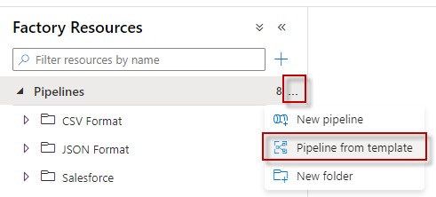
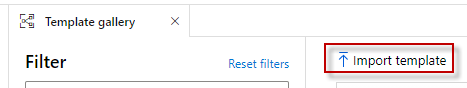
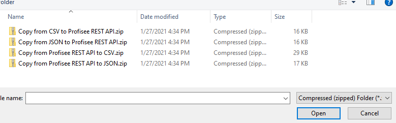
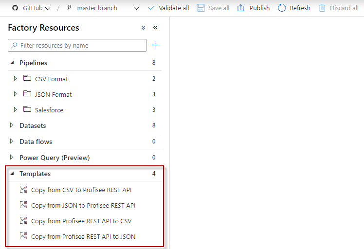

# Import Profisee ADF templates to ADF

This page describes how to import the Profisee ADF templates to your ADF.

1.  Download each desired template in this folder to your computer.

    1.  Click on the zip file.

    2.  Click on the **Download** button.

2.  In ADF, click the **…** button in the Pipelines panel.

    

3.  Click on **Import template**.

    

4.  Browse to where you downloaded the templates on your computer.

    1.  Select the template zip file.

    2.  Select Open

        

5.  The templates should appear in the bottom left.

    
