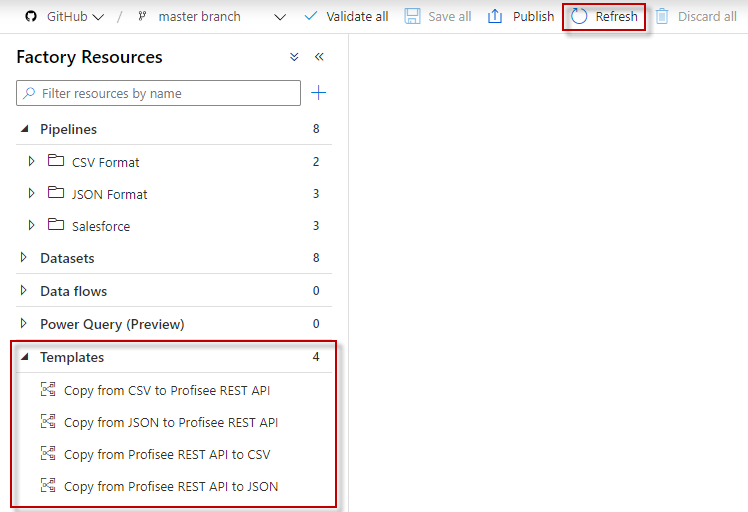

# Clone Profisee ADF templates to your GitHub repository

This page describes how to clone the Profisee ADF templates to your ADF
GitHub repository

1.  Set up source control for your ADF - [<u>Source Control in ADF</u>](https://docs.microsoft.com/en-us/azure/data-factory/source-control)
	1.	With ADF and Git integration, make sure the branch and folder names are in lowercase.
	
2.  Clone your ADF repository to your computer. - [<u>Cloning a repository</u>](https://docs.github.com/en/github/creating-cloning-and-archiving-repositories/cloning-a-repository)

3.  Clone the
    [<u>https://github.com/Profisee/azuredatafactory</u>](https://github.com/Profisee/azuredatafactory)
    repository to your computer.

4.	Copy the **templates** folder to your cloned ADF repository (from step 2).  Then delete the **README.md** file in your cloned repository.  These are not needed.

5.  Commit and push the templates files to your ADF GitHub repository.

6.  In ADF, click the Refresh button then your templates should appear
    in the bottom left.

   
